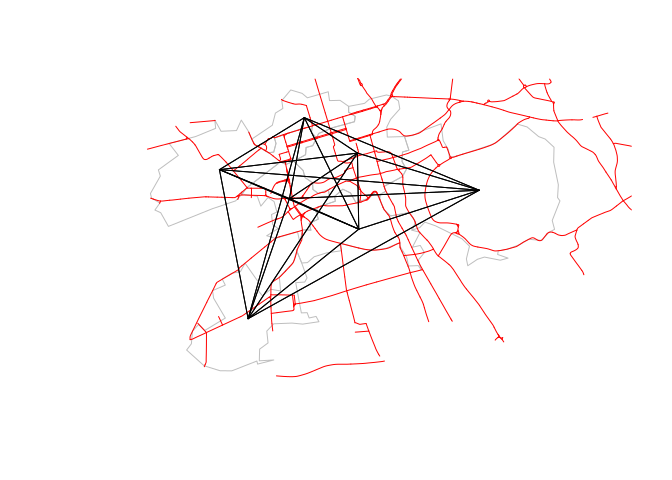
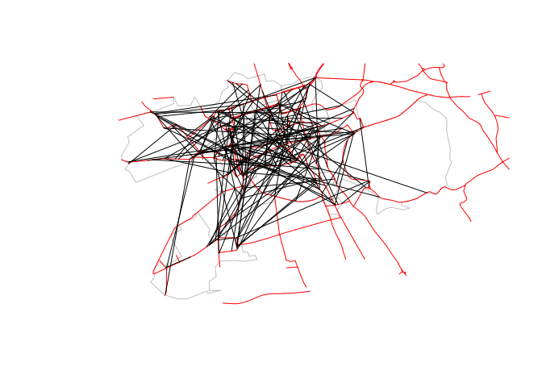
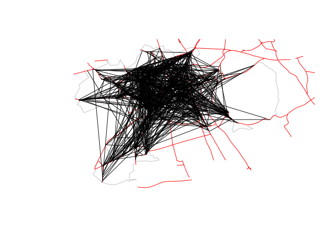

# odjitter

This crate contains an implementation of the ‘jittering’ technique for
pre-processing origin-destination (OD) data. Jittering in a data
visualisation context refers to the addition of “random noise to the
data” to prevent points in graphs from overlapping, as described in by
Wickham et al. ([2016](https://ggplot2-book.org/)) and in the
documentation page for the function
[`geom_jitter()`](https://ggplot2.tidyverse.org/reference/geom_jitter.html).

In the context of OD data jittering refers to randomly moving start and
end points associated with OD pairs, as described in an under review
paper on the subject (Lovelace et al. under review). The technique is
implemented in the function
[`od_jitter()`](https://itsleeds.github.io/od/reference/od_jitter.html)
in the [`od`](https://itsleeds.github.io/od/index.html) R package. The
functionality contained in this repo is an extended and much faster
implementation: according to our benchmarks on a large dataset it was
around 1000 times faster than the R implementation.

The crate is still a work in progress: the API may change. Issues and
pull requests are particularly useful at this stage.

<!-- Todo: add worked example. Will do for GISRUK paper -->
<!-- An illustration of its functionality is shown below. -->

# Installation

Install the package from the system command line as follows (you need to
have installed and set-up
[cargo](https://doc.rust-lang.org/cargo/getting-started/installation.html)
first):

``` bash
cargo install --git https://github.com/dabreegster/odjitter
```

To check the package installation worked, you can run `odjitter` command
without arguments. If it prints the following message congratulations,
it works 🎉

``` bash
odjitter
```

    ## error: The following required arguments were not provided:
    ##     --od-csv-path <OD_CSV_PATH>
    ##     --zones-path <ZONES_PATH>
    ##     --output-path <OUTPUT_PATH>
    ##     --max-per-od <MAX_PER_OD>
    ## 
    ## USAGE:
    ##     odjitter [OPTIONS] --od-csv-path <OD_CSV_PATH> --zones-path <ZONES_PATH> --output-path <OUTPUT_PATH> --max-per-od <MAX_PER_OD>
    ## 
    ## For more information try --help

# Usage

To run algorithm you need a minimum of three inputs, examples of which
are provided in the `data/` folder of this repo:

1.  A .csv file containing OD data with the first two columns containing
    zone IDs and subsequent columns representing trip counts:

| geo\_code1 | geo\_code2 | all | from\_home | train | bus | car\_driver | car\_passenger | bicycle | foot | other |
|:-----------|:-----------|----:|-----------:|------:|----:|------------:|---------------:|--------:|-----:|------:|
| S02001616  | S02001616  |  82 |          0 |     0 |   3 |           6 |              0 |       2 |   71 |     0 |
| S02001616  | S02001620  | 188 |          0 |     0 |  42 |          26 |              3 |      11 |  105 |     1 |
| S02001616  | S02001621  |  99 |          0 |     0 |  13 |           7 |              3 |      15 |   61 |     0 |

1.  A [.geojson
    file](https://github.com/dabreegster/odjitter/blob/main/data/zones.geojson)
    representing zones, with the first column matching the zone IDs in
    the OD data (called InterZone in this case):

``` bash
head -6 data/zones.geojson
```

    ## {
    ## "type": "FeatureCollection",
    ## "name": "zones_min",
    ## "crs": { "type": "name", "properties": { "name": "urn:ogc:def:crs:OGC:1.3:CRS84" } },
    ## "features": [
    ## { "type": "Feature", "properties": { "InterZone": "S02001616", "Name": "Merchiston and Greenhill", "TotPop2011": 5018, "ResPop2011": 4730, "HHCnt2011": 2186, "StdAreaHa": 126.910911, "StdAreaKm2": 1.269109, "Shape_Leng": 9073.5402482000009, "Shape_Area": 1269109.10155 }, "geometry": { "type": "MultiPolygon", "coordinates": [ [ [ [ -3.2040366, 55.9333372 ], [ -3.2036354, 55.9321624 ], [ -3.2024036, 55.9321874 ], [ -3.2019838, 55.9315586 ], [ -3.2005071, 55.9317411 ], [ -3.199902, 55.931113 ], [ -3.2033504, 55.9308279 ], [ -3.2056319, 55.9309507 ], [ -3.2094979, 55.9308666 ], [ -3.2109753, 55.9299985 ], [ -3.2107073, 55.9285904 ], [ -3.2124928, 55.927854 ], [ -3.2125633, 55.9264661 ], [ -3.2094928, 55.9265616 ], [ -3.212929, 55.9260741 ], [ -3.2130774, 55.9264384 ], [ -3.2183973, 55.9252709 ], [ -3.2208941, 55.925282 ], [ -3.2242732, 55.9258683 ], [ -3.2279975, 55.9277452 ], [ -3.2269867, 55.928489 ], [ -3.2267625, 55.9299817 ], [ -3.2254561, 55.9307854 ], [ -3.224148, 55.9300725 ], [ -3.2197791, 55.9315472 ], [ -3.2222706, 55.9339127 ], [ -3.2224909, 55.934809 ], [ -3.2197844, 55.9354692 ], [ -3.2204535, 55.936195 ], [ -3.218362, 55.9368806 ], [ -3.2165749, 55.937069 ], [ -3.215582, 55.9380761 ], [ -3.2124132, 55.9355465 ], [ -3.212774, 55.9347972 ], [ -3.2119068, 55.9341947 ], [ -3.210138, 55.9349668 ], [ -3.208051, 55.9347716 ], [ -3.2083105, 55.9364224 ], [ -3.2053546, 55.9381495 ], [ -3.2046077, 55.9395298 ], [ -3.20356, 55.9380951 ], [ -3.2024323, 55.936318 ], [ -3.2029121, 55.935831 ], [ -3.204832, 55.9357555 ], [ -3.2040366, 55.9333372 ] ] ] ] } },

1.  A [.geojson
    file](https://github.com/dabreegster/odjitter/blob/main/data/road_network.geojson)
    representing a transport network from which origin and destination
    points are sampled

``` bash
head -6 data/road_network.geojson
```

    ## {
    ## "type": "FeatureCollection",
    ## "name": "road_network_min",
    ## "crs": { "type": "name", "properties": { "name": "urn:ogc:def:crs:OGC:1.3:CRS84" } },
    ## "features": [
    ## { "type": "Feature", "properties": { "osm_id": "3468", "name": "Albyn Place", "highway": "tertiary", "waterway": null, "aerialway": null, "barrier": null, "man_made": null, "access": null, "bicycle": null, "service": null, "z_order": 4, "other_tags": "\"lit\"=>\"yes\",\"lanes\"=>\"3\",\"maxspeed\"=>\"20 mph\",\"sidewalk\"=>\"both\",\"lanes:forward\"=>\"2\",\"lanes:backward\"=>\"1\"" }, "geometry": { "type": "LineString", "coordinates": [ [ -3.207438, 55.9533584 ], [ -3.2065953, 55.9535098 ] ] } },

The `jitter` function requires you to set the maximum number of trips
for all trips in the jittered result. A value of 1 will create a line
for every trip in the dataset, a value above the maximum number of trips
in the ‘all’ column in the OD ata will result in a jittered dataset that
has the same number of desire lines as in the input (50 in this case).

With reference to the test data in this repo, you can run the `jitter`
command line tool as follows:

``` bash
# With max-per-od of 50
odjitter --od-csv-path data/od.csv \
  --zones-path data/zones.geojson \
  --subpoints-path data/road_network.geojson \
  --max-per-od 50 --output-path output_max50.geojson
```

    ## Scraped 7 zones from data/zones.geojson
    ## Scraped 5073 subpoints from data/road_network.geojson
    ## Disaggregating OD data
    ## Wrote output_max50.geojson

Try running it with a different `max-per-od` value:

``` bash
# With max-per-od of 10
odjitter --od-csv-path data/od.csv \
  --zones-path data/zones.geojson \
  --subpoints-path data/road_network.geojson \
  --max-per-od 10 --output-path output_max10.geojson
```

    ## Scraped 7 zones from data/zones.geojson
    ## Scraped 5073 subpoints from data/road_network.geojson
    ## Disaggregating OD data
    ## Wrote output_max10.geojson

# Outputs

The figure below shows the output of the `jitter` commands above
visually, with the left image showing unjittered results with origins
and destinations going to zone centroids (as many if not most OD pairs
are visualised), the central image showing the result after setting
`max-per-od` argument to 50, and the right hand figure showing the
result after setting `max-per-od` to 10.



Note: `odjitter` uses a random number generator to sample points, so the
output will change each time you run it, unless you set the `rng-seed`,
as documented in the next section.

# Details

For full details on `odjitter`’s arguments run `odjitter --help` which
gives the following output:

``` bash
odjitter --help
```

    ## odjitter 0.1.0
    ## Dustin Carlino <dabreegster@gmail.com
    ## Disaggregate origin/destination data from zones to points
    ## 
    ## USAGE:
    ##     odjitter [OPTIONS] --od-csv-path <OD_CSV_PATH> --zones-path <ZONES_PATH> --output-path <OUTPUT_PATH> --max-per-od <MAX_PER_OD>
    ## 
    ## OPTIONS:
    ##         --all-key <ALL_KEY>
    ##             Which column in the OD row specifies the total number of trips to disaggregate?
    ##             [default: all]
    ## 
    ##         --destination-key <DESTINATION_KEY>
    ##             Which column in the OD row specifies the zone where trips ends? [default: geo_code2]
    ## 
    ##     -h, --help
    ##             Print help information
    ## 
    ##         --max-per-od <MAX_PER_OD>
    ##             What's the maximum number of trips per output OD row that's allowed? If an input OD row
    ##             contains less than this, it will appear in the output without transformation. Otherwise,
    ##             the input row is repeated until the sum matches the original value, but each output row
    ##             obeys this maximum
    ## 
    ##         --min-distance-meters <MIN_DISTANCE_METERS>
    ##             Guarantee that jittered points are at least this distance apart [default: 1.0]
    ## 
    ##         --od-csv-path <OD_CSV_PATH>
    ##             The path to a CSV file with aggregated origin/destination data
    ## 
    ##         --origin-key <ORIGIN_KEY>
    ##             Which column in the OD row specifies the zone where trips originate? [default:
    ##             geo_code1]
    ## 
    ##         --output-path <OUTPUT_PATH>
    ##             The path to a GeoJSON file where the disaggregated output will be written
    ## 
    ##         --rng-seed <RNG_SEED>
    ##             By default, the output will be different every time the tool is run, based on a
    ##             different random number generator seed. Specify this to get deterministic behavior,
    ##             given the same input
    ## 
    ##         --subpoints-path <SUBPOINTS_PATH>
    ##             The path to a GeoJSON file with subpoints to sample from. If this isn't specified,
    ##             random points within each zone will be used instead
    ## 
    ##     -V, --version
    ##             Print version information
    ## 
    ##         --zone-name-key <ZONE_NAME_KEY>
    ##             In the zones GeoJSON file, which property is the name of a zone [default: InterZone]
    ## 
    ##         --zones-path <ZONES_PATH>
    ##             The path to a GeoJSON file with named zones

# References

Lovelace, Robin, Rosa Félix, and Dustin Carlino Under Review Jittering:
A Computationally Efficient Method for Generating Realistic Route
Networks from Origin-Destination Data. TBC.

Wickham, Hadley 2016 ggplot2: Elegant Graphics for Data Analysis. 2nd
ed. 2016 edition. New York, NY: Springer.
