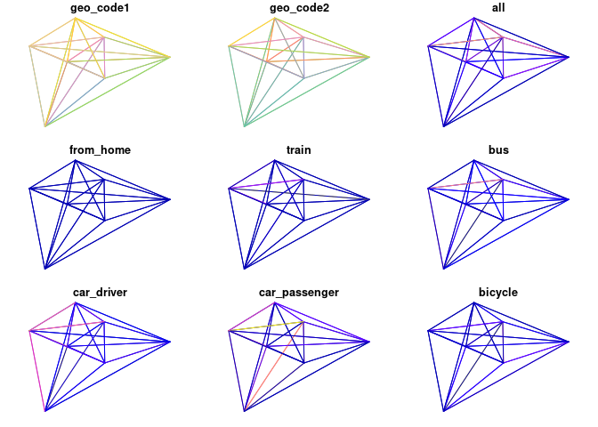
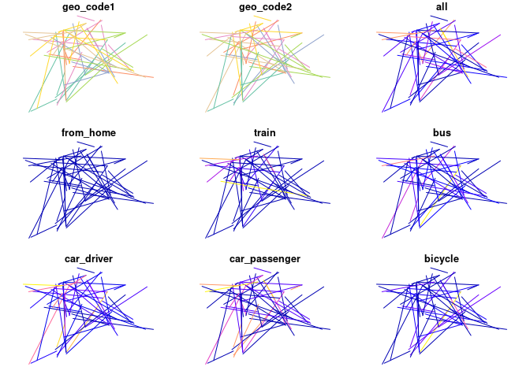

<!-- README.md is generated from README.Rmd. Please edit that file -->

# odjitter R package

<!-- badges: start -->

<!-- badges: end -->

The goal of this {odjitter} R package is to provide an R interface to
the [odjitter](https://github.com/dabreegster/odjitter) Rust crate for
processing origin-destination data.

Install the development version as follows

``` r
remotes::install_github("dabreegster/odjitter", subdir = "r")
```

## R interface to `odjitter` Rust crate via system commands

``` r
library(odjitter)
#> 
#> Attaching package: 'odjitter'
#> The following object is masked from 'package:base':
#> 
#>     jitter
```

``` r
od = readr::read_csv("https://github.com/dabreegster/odjitter/raw/main/data/od.csv")
#> Rows: 49 Columns: 11
#> ── Column specification ────────────────────────────────────────────────────────
#> Delimiter: ","
#> chr (2): geo_code1, geo_code2
#> dbl (9): all, from_home, train, bus, car_driver, car_passenger, bicycle, foo...
#> 
#> ℹ Use `spec()` to retrieve the full column specification for this data.
#> ℹ Specify the column types or set `show_col_types = FALSE` to quiet this message.
zones = sf::read_sf("https://github.com/dabreegster/odjitter/raw/main/data/zones.geojson")
names(zones)[1] = "geo_code"
road_network = sf::read_sf("https://github.com/dabreegster/odjitter/raw/main/data/road_network.geojson")
od_unjittered = od::od_to_sf(od, zones)
#> 0 origins with no match in zone ids
#> 0 destinations with no match in zone ids
#>  points not in od data removed.
set.seed(42) # for reproducibility
od_jittered = jitter(od, zones, subpoints = road_network)
nrow(od_unjittered)
#> [1] 49
nrow(od_jittered)
#> [1] 49
plot(od_unjittered)
#> Warning: plotting the first 9 out of 11 attributes; use max.plot = 11 to plot
#> all
plot(od_jittered)
#> Warning: plotting the first 9 out of 11 attributes; use max.plot = 11 to plot
#> all
```



## Allowing duplicate OD pairs

By default the `jitter` function will remove duplicate OD pairs. This
can be disabled by setting `deduplicate_pairs = FALSE`.

``` r
#  Default behaviour (no duplicates):
od_jittered = jitter(
  od,
  zones,
  subpoints = road_network,
  disaggregation_threshold = 1,
  show_command = TRUE,
)
#> command sent to the system:
#> odjitter jitter --od-csv-path /tmp/RtmpfqvyCC/od.csv --zones-path /tmp/RtmpfqvyCC/zones.geojson --zone-name-key geo_code --origin-key geo_code1 --destination-key geo_code2 --subpoints-origins-path /tmp/RtmpfqvyCC/subpoints.geojson --subpoints-destinations-path /tmp/RtmpfqvyCC/subpoints.geojson --disaggregation-key all --disaggregation-threshold 1 --rng-seed 93708 --deduplicate-pairs  --output-path /tmp/RtmpfqvyCC/od_jittered.geojson
summary(duplicated(od_jittered$geometry))
#>    Mode   FALSE 
#> logical    6555
```

``` r
# Larger example:
od_jittered = jitter(
  od,
  zones,
  subpoints = road_network,
  disaggregation_threshold = 1,
  show_command = TRUE,
  deduplicate_pairs = FALSE
)
#> command sent to the system:
#> odjitter jitter --od-csv-path /tmp/RtmpfqvyCC/od.csv --zones-path /tmp/RtmpfqvyCC/zones.geojson --zone-name-key geo_code --origin-key geo_code1 --destination-key geo_code2 --subpoints-origins-path /tmp/RtmpfqvyCC/subpoints.geojson --subpoints-destinations-path /tmp/RtmpfqvyCC/subpoints.geojson --disaggregation-key all --disaggregation-threshold 1 --rng-seed 28614   --output-path /tmp/RtmpfqvyCC/od_jittered.geojson
summary(duplicated(od_jittered$geometry))
#>    Mode   FALSE    TRUE 
#> logical    6545      10
```

## R interface to Rust via rextendr (not currently working)

The development of the package was done using the development version of
the `rextendr` package.

``` r
remotes::install_github("extendr/rextendr")
```

The package template was created as follows:

``` r
usethis::use_description()
rextendr::use_extendr()
```

The odjitter Rust crate ported into the src/rust folder.
